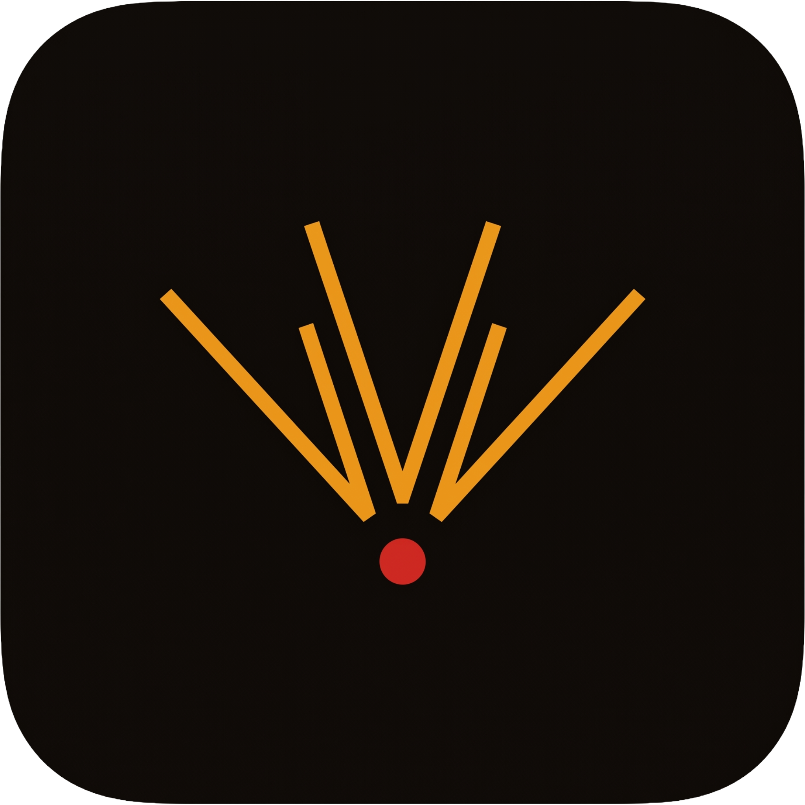
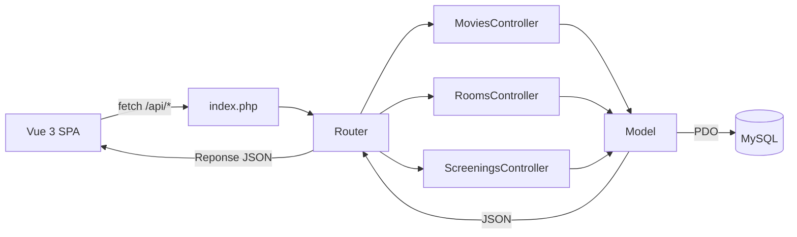

<p align="center">
  <a href="https://github.com/Sofian-bll/ept-my-cinema/blob/main/LICENSE">
    
  </a>
  <a href="https://github.com/Sofian-bll/ept-my-cinema/releases">
    
  </a>
  <a href="https://github.com/Sofian-bll/ept-my-cinema/stargazers">
    
  </a>
</p>

<p align="center">
  
</p>

<h1 id="readme-top" align="center">My Cinema</h1>

<p align="center">
  Back-office de gestion de cinema | Projet Epitech · PHP MVC + Vue 3 + MySQL
</p>

<p align="center">🇬🇧 <a href="README.md">English</a> · 🇫🇷 <a href="README.fr.md"><b>Francais</b></a></p>

<details open>
  <summary>Table des matieres</summary>
  <ol>
    <li><a href="#a-propos">A propos</a></li>
    <li><a href="#fonctionnalites">Fonctionnalites</a></li>
    <li><a href="#technologies">Technologies</a></li>
    <li><a href="#comment-ca-marche">Comment ca marche</a></li>
    <li><a href="#prerequis">Prerequis</a></li>
    <li><a href="#installation">Installation</a></li>
    <li><a href="#configuration">Configuration</a></li>
    <li><a href="#utilisation">Utilisation</a></li>
    <li><a href="#structure-du-projet">Structure du projet</a></li>
    <li><a href="#architecture">Architecture</a></li>
    <li><a href="#licence">Licence</a></li>
  </ol>
</details>

---

## A propos

My Cinema est une application web de back-office destinee aux gerants de cinema. Elle fournit une interface d'administration complete pour gerer les films a l'affiche, les salles de projection et le planning des seances. Realise dans le cadre d'un projet Epitech, elle implemente une architecture MVC personnalisee en PHP sans framework, en respectant les bonnes pratiques de securite (requetes preparees, validation des entrees) et de conception orientee objet.

## Fonctionnalites

- **Gestion des films** — CRUD complet pour les films avec titre, realisateur, genre, duree et annee de sortie. Les films ayant des seances existantes sont proteges contre la suppression.
- **Gestion des salles** — Creation, modification et suppression logicielle (soft delete) des salles. Chaque salle possede un nom, une capacite et un type (Standard, 3D, IMAX).
- **Planification des seances** — Programmation des seances dans des salles specifiques a des horaires precis. Detection automatique des conflits pour eviter les chevauchements et doubles reservations, en tenant compte de la duree du film.
- **API REST** — API JSON complete avec 15 points d'acces couvrant toutes les operations CRUD pour les films, salles et seances.
- **Dashboard moderne** — Application monopage (SPA) construite avec Vue 3 et les composants shadcn-vue, avec theme clair/sombre, tableaux responsifs et validation des formulaires.

## Technologies

- [](https://www.php.net/) — Runtime backend (8.3+)
- [](https://vuejs.org/) — Framework frontend
- [](https://www.mysql.com/) — Base de donnees relationnelle
- [](https://tailwindcss.com/) — Framework CSS utilitaire
- [](https://vitejs.dev/) — Outil de build frontend
- [](https://getcomposer.org/) — Gestionnaire de dependances PHP

<p align="right">(<a href="#readme-top">retour en haut</a>)</p>

## Comment ca marche



La SPA frontend Vue 3 communique avec le backend via des appels `fetch()` vers les endpoints de l'API REST. Le point d'entree unique du backend (`index.php`) route les requetes vers le controleur approprie, qui valide les entrees, appelle la couche modele et renvoie des reponses JSON. Les modeles utilisent PDO avec des requetes preparees pour toutes les operations en base de donnees.

<p align="right">(<a href="#readme-top">retour en haut</a>)</p>

## Prerequis

- **PHP** 8.3 ou superieur
- **MySQL** 8.0 ou superieur
- **Composer** (gestionnaire de dependances PHP)
- **Node.js** 18+ et npm

<p align="right">(<a href="#readme-top">retour en haut</a>)</p>

## Installation

1. Cloner le depot :
   ```sh
   git clone https://github.com/Sofian-bll/ept-my-cinema.git
   cd my-cinema
   ```

2. Installer les dependances PHP :
   ```sh
   cd backend
   composer install
   ```

3. Installer les dependances frontend :
   ```sh
   cd ../frontend
   npm install
   ```

4. Creer la base de donnees :
   ```sh
   mysql -u root -p < ../backend/database/schema.sql
   ```

   Optionnellement, peupler avec des donnees d'exemple :
   ```sh
   mysql -u root -p < ../backend/database/seed.sql
   ```

<p align="right">(<a href="#readme-top">retour en haut</a>)</p>

## Configuration

1. Copier le fichier d'environnement dans le dossier backend :
   ```sh
   cd backend
   cp .env.example .env
   ```

2. Editer `.env` avec vos identifiants de base de donnees :
   ```env
   APP_ENV=dev
   DB_HOST=localhost
   DB_NAME=my_cinema
   DB_USER=root
   DB_PASS=votre_mot_de_passe
   ```

<p align="right">(<a href="#readme-top">retour en haut</a>)</p>

## Utilisation

Demarrer le backend (serveur integre PHP) :
```sh
cd backend
php -S localhost:8000 -t public
```

Demarrer le frontend (serveur de dev Vite) :
```sh
cd frontend
npm run dev
```

Ouvrir [http://localhost:5173](http://localhost:5173) dans le navigateur. Le dashboard propose :

- **Dashboard** — Vue d'ensemble du cinema
- **Films** — Ajouter, modifier et supprimer des films
- **Salles** — Gerer les salles de projection et leurs types
- **Seances** — Planifier et gerer les seances
- **Parametres** — Preferences de l'application

### Points d'acces API

| Methode | Endpoint | Description |
|--------|----------|-------------|
| GET | `/api/movies` | Lister tous les films |
| GET | `/api/movies/{id}` | Detail d'un film avec ses seances |
| POST | `/api/movies` | Creer un film |
| PUT | `/api/movies/{id}` | Modifier un film |
| DELETE | `/api/movies/{id}` | Supprimer un film |
| GET | `/api/rooms` | Lister toutes les salles |
| GET | `/api/rooms/{id}` | Detail d'une salle |
| POST | `/api/rooms` | Creer une salle |
| PUT | `/api/rooms/{id}` | Modifier une salle |
| DELETE | `/api/rooms/{id}` | Suppression logicielle d'une salle |
| GET | `/api/screenings` | Lister toutes les seances |
| GET | `/api/screenings/{id}` | Detail d'une seance |
| POST | `/api/screenings` | Creer une seance |
| PUT | `/api/screenings/{id}` | Modifier une seance |
| DELETE | `/api/screenings/{id}` | Supprimer une seance |

<p align="right">(<a href="#readme-top">retour en haut</a>)</p>

## Structure du projet

```
my-cinema/
├── backend/
│   ├── app/
│   │   ├── Controllers/     # Gestionnaires de requetes (Movies, Rooms, Screenings)
│   │   ├── Core/            # Router, Database, Model, Controller
│   │   ├── Helpers/         # Validation, utilitaires de date
│   │   ├── Models/          # Classes entite (Movies, Rooms, Screenings)
│   │   └── Traits/          # Comportement SoftDelete
│   ├── config/              # Routes et configuration de la base de donnees
│   ├── database/
│   │   ├── schema.sql       # Schema de la base de donnees
│   │   └── seed.sql         # Donnees d'exemple
│   ├── public/
│   │   └── index.php        # Point d'entree unique
│   ├── tests/               # Tests PHPUnit
│   └── composer.json
├── frontend/
│   ├── src/
│   │   ├── components/      # Composants Vue (ui, layout, films, salles, seances)
│   │   ├── pages/           # Pages (Dashboard, Movies, Rooms, Screenings)
│   │   ├── router/          # Configuration Vue Router
│   │   └── assets/          # Styles CSS
│   ├── package.json
│   └── vite.config.js
├── docs/
│   └── assets/
│       └── logo.png
├── LICENSE
└── .gitignore
```

<p align="right">(<a href="#readme-top">retour en haut</a>)</p>

## Architecture

Le backend suit un pattern MVC personnalise sans framework PHP :

- **Point d'entree :** `backend/public/index.php` — Toutes les requetes passent par ce fichier unique
- **Router :** `Core/Router.php` — Fait correspondre les motifs d'URL et les methodes HTTP aux actions des controleurs
- **Controleurs :** Gerent la logique requete/reponse, valident les entrees, appellent les modeles
- **Modeles :** Etendent `Core/Model.php` — Fournissent des operations CRUD basees sur PDO avec requetes preparees
- **Traits :** `SoftDeleteTrait` — Implemente la suppression logicielle pour les salles (conserve les donnees avec un horodatage)
- **Gestion d'erreurs :** Gestionnaire d'erreurs centralise avec reponses JSON

Toute la logique metier est cote serveur. Le frontend est une SPA Vue 3 legere qui consomme l'API REST — aucune logique metier en JavaScript.

<p align="right">(<a href="#readme-top">retour en haut</a>)</p>

## Licence

Distribue sous licence MIT. Voir [LICENSE](LICENSE) pour plus d'informations.

<p align="right">(<a href="#readme-top">retour en haut</a>)</p>

<!-- REFERENCE_LINKS -->
[php]: https://img.shields.io/badge/PHP-777BB4?style=flat&logo=php&logoColor=white
[vue]: https://img.shields.io/badge/vuejs-%2335495e.svg?style=flat&logo=vuedotjs&logoColor=%234FC08D
[mysql]: https://img.shields.io/badge/MySQL-4479A1?style=flat&logo=mysql&logoColor=white
[tailwind]: https://img.shields.io/badge/tailwindcss-%2338B2AC.svg?style=flat&logo=tailwind-css&logoColor=white
[vite]: https://img.shields.io/badge/vite-%23646CFF.svg?style=flat&logo=vite&logoColor=white
[composer]: https://img.shields.io/badge/Composer-885630?style=flat&logo=composer&logoColor=white
