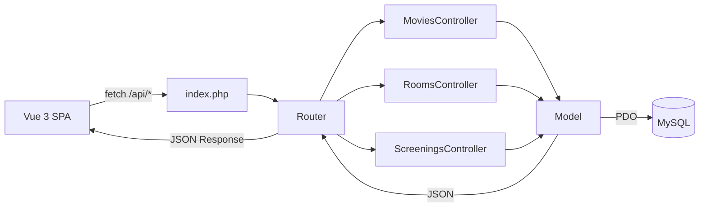

<p align="center">
  <a href="https://github.com/Sofian-bll/ept-my-cinema/blob/main/LICENSE">
    
  </a>
  <a href="https://github.com/Sofian-bll/ept-my-cinema/releases">
    
  </a>
  <a href="https://github.com/Sofian-bll/ept-my-cinema/stargazers">
    
  </a>
</p>

<p align="center">
  
</p>

<h1 id="readme-top" align="center">My Cinema</h1>

<p align="center">
  Back-office for cinema management | Epitech project · PHP MVC + Vue 3 + MySQL
</p>

<p align="center">🇬🇧 <a href="README.md"><b>English</b></a> · 🇫🇷 <a href="README.fr.md">Français</a></p>

<details open>
  <summary>Table of Contents</summary>
  <ol>
    <li><a href="#what-is-this">What is this?</a></li>
    <li><a href="#features">Features</a></li>
    <li><a href="#built-with">Built With</a></li>
    <li><a href="#how-it-works">How It Works</a></li>
    <li><a href="#prerequisites">Prerequisites</a></li>
    <li><a href="#installation">Installation</a></li>
    <li><a href="#configuration">Configuration</a></li>
    <li><a href="#usage">Usage</a></li>
    <li><a href="#project-structure">Project Structure</a></li>
    <li><a href="#architecture">Architecture</a></li>
    <li><a href="#license">License</a></li>
  </ol>
</details>

---

## What is this?

My Cinema is a back-office web application for cinema managers. It provides a complete administration interface to manage movies, screening rooms, and showtime schedules. Built as an Epitech project, it implements a custom MVC architecture in PHP without any framework, following best practices for security (prepared statements, input validation) and object-oriented design.

## Features

- **Movie management** — Full CRUD for movies with title, director, genre, duration, and release year. Movies with existing screenings are protected from deletion.
- **Room management** — Create, edit, and soft-delete screening rooms. Each room has a name, capacity, and type (Standard, 3D, IMAX).
- **Screening scheduling** — Schedule film screenings in specific rooms at specific times. Automatic conflict detection prevents double-booking and overlapping screenings based on movie duration.
- **REST API** — Complete JSON API with 15 endpoints covering all CRUD operations for movies, rooms, and screenings.
- **Modern dashboard** — Single-page application built with Vue 3 and shadcn-vue components, featuring dark/light theme, responsive tables, and form validation.

## Built With

- [](https://www.php.net/) — Backend runtime (8.3+)
- [](https://vuejs.org/) — Frontend framework
- [](https://www.mysql.com/) — Relational database
- [](https://tailwindcss.com/) — Utility-first CSS framework
- [](https://vitejs.dev/) — Frontend build tool
- [](https://getcomposer.org/) — PHP dependency manager

<p align="right">(<a href="#readme-top">back to top</a>)</p>

## How It Works



The frontend Vue 3 SPA communicates with the backend through `fetch()` calls to REST API endpoints. The backend's single entry point (`index.php`) routes requests to the appropriate controller, which validates input, calls the model layer, and returns JSON responses. Models use PDO with prepared statements for all database operations.

<p align="right">(<a href="#readme-top">back to top</a>)</p>

## Prerequisites

- **PHP** 8.3 or higher
- **MySQL** 8.0 or higher
- **Composer** (PHP dependency manager)
- **Node.js** 18+ and npm

<p align="right">(<a href="#readme-top">back to top</a>)</p>

## Installation

1. Clone the repository:
   ```sh
   git clone https://github.com/Sofian-bll/ept-my-cinema.git
   cd my-cinema
   ```

2. Install PHP dependencies:
   ```sh
   cd backend
   composer install
   ```

3. Install frontend dependencies:
   ```sh
   cd ../frontend
   npm install
   ```

4. Create the database:
   ```sh
   mysql -u root -p < ../backend/database/schema.sql
   ```

   Optionally, seed with sample data:
   ```sh
   mysql -u root -p < ../backend/database/seed.sql
   ```

<p align="right">(<a href="#readme-top">back to top</a>)</p>

## Configuration

1. Copy the environment file in the backend directory:
   ```sh
   cd backend
   cp .env.example .env
   ```

2. Edit `.env` with your database credentials:
   ```env
   APP_ENV=dev
   DB_HOST=localhost
   DB_NAME=my_cinema
   DB_USER=root
   DB_PASS=your_password
   ```

<p align="right">(<a href="#readme-top">back to top</a>)</p>

## Usage

Start the backend (PHP built-in server):
```sh
cd backend
php -S localhost:8000 -t public
```

Start the frontend (Vite dev server):
```sh
cd frontend
npm run dev
```

Open [http://localhost:5173](http://localhost:5173) in your browser. The dashboard provides:

- **Dashboard** — Overview of the cinema
- **Movies** — Add, edit, and delete films
- **Rooms** — Manage screening rooms and their types
- **Screenings** — Schedule and manage film showtimes
- **Settings** — Application preferences

### API Endpoints

| Method | Endpoint | Description |
|--------|----------|-------------|
| GET | `/api/movies` | List all movies |
| GET | `/api/movies/{id}` | Get movie details with screenings |
| POST | `/api/movies` | Create a movie |
| PUT | `/api/movies/{id}` | Update a movie |
| DELETE | `/api/movies/{id}` | Delete a movie |
| GET | `/api/rooms` | List all rooms |
| GET | `/api/rooms/{id}` | Get room details |
| POST | `/api/rooms` | Create a room |
| PUT | `/api/rooms/{id}` | Update a room |
| DELETE | `/api/rooms/{id}` | Soft-delete a room |
| GET | `/api/screenings` | List all screenings |
| GET | `/api/screenings/{id}` | Get screening details |
| POST | `/api/screenings` | Create a screening |
| PUT | `/api/screenings/{id}` | Update a screening |
| DELETE | `/api/screenings/{id}` | Delete a screening |

<p align="right">(<a href="#readme-top">back to top</a>)</p>

## Project Structure

```
my-cinema/
├── backend/
│   ├── app/
│   │   ├── Controllers/     # Request handlers (Movies, Rooms, Screenings)
│   │   ├── Core/            # Router, Database, Model base, Controller base
│   │   ├── Helpers/         # Validation, Date utilities
│   │   ├── Models/          # Entity classes (Movies, Rooms, Screenings)
│   │   └── Traits/          # SoftDelete behavior
│   ├── config/              # Routes and database configuration
│   ├── database/
│   │   ├── schema.sql       # Database schema
│   │   └── seed.sql         # Sample data
│   ├── public/
│   │   └── index.php        # Single entry point
│   ├── tests/               # PHPUnit tests
│   └── composer.json
├── frontend/
│   ├── src/
│   │   ├── components/      # Vue components (ui, layout, movies, rooms, screenings)
│   │   ├── pages/           # Page components (Dashboard, Movies, Rooms, Screenings)
│   │   ├── router/          # Vue Router configuration
│   │   └── assets/          # CSS styles
│   ├── package.json
│   └── vite.config.js
├── docs/
│   └── assets/
│       └── logo.png
├── LICENSE
└── .gitignore
```

<p align="right">(<a href="#readme-top">back to top</a>)</p>

## Architecture

The backend follows a custom MVC pattern without any PHP framework:

- **Entry point:** `backend/public/index.php` — All requests are routed through this single file
- **Router:** `Core/Router.php` — Matches URL patterns and HTTP methods to controller actions
- **Controllers:** Handle request/response logic, validate input, call models
- **Models:** Extend `Core/Model.php` — Provide PDO-based CRUD operations with prepared statements
- **Traits:** `SoftDeleteTrait` — Implements soft delete for rooms (preserves data with a deleted timestamp)
- **Error handling:** Centralized error handler with JSON error responses

All business logic is server-side. The frontend is a thin Vue 3 SPA that consumes the REST API — no business logic in JavaScript.

<p align="right">(<a href="#readme-top">back to top</a>)</p>

## License

Distributed under the MIT License. See [LICENSE](LICENSE) for more information.

<p align="right">(<a href="#readme-top">back to top</a>)</p>

<!-- REFERENCE_LINKS -->
[php]: https://img.shields.io/badge/PHP-777BB4?style=flat&logo=php&logoColor=white
[vue]: https://img.shields.io/badge/vuejs-%2335495e.svg?style=flat&logo=vuedotjs&logoColor=%234FC08D
[mysql]: https://img.shields.io/badge/MySQL-4479A1?style=flat&logo=mysql&logoColor=white
[tailwind]: https://img.shields.io/badge/tailwindcss-%2338B2AC.svg?style=flat&logo=tailwind-css&logoColor=white
[vite]: https://img.shields.io/badge/vite-%23646CFF.svg?style=flat&logo=vite&logoColor=white
[composer]: https://img.shields.io/badge/Composer-885630?style=flat&logo=composer&logoColor=white
